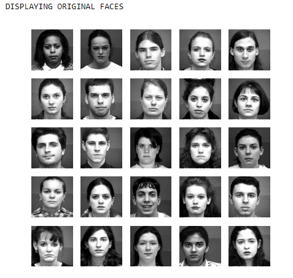
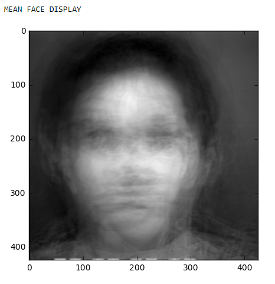
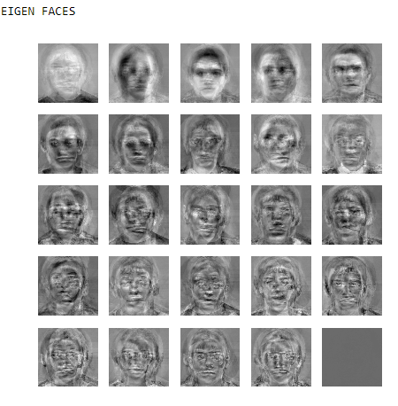
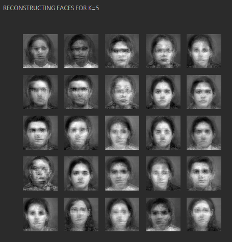
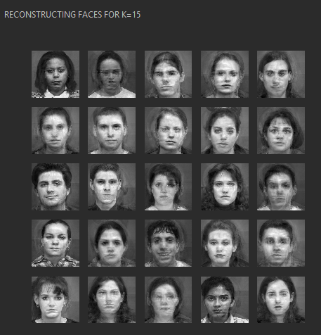
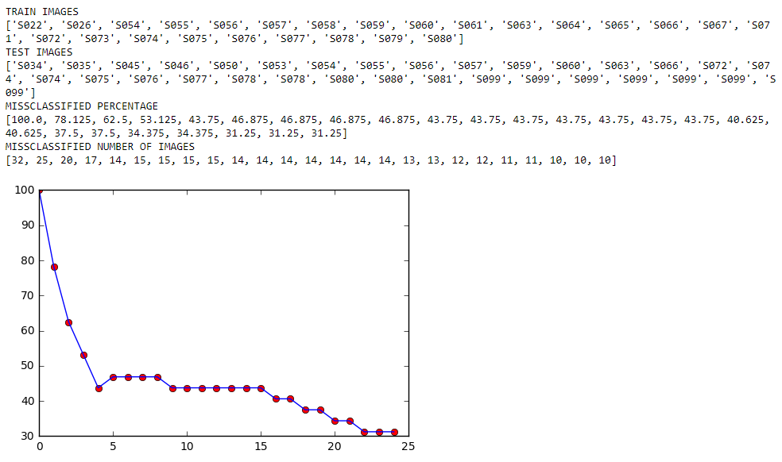

# PCA-and-Eigen-Faces
Face Recognition
Task1:
Load all 25 images in the Eigenfaces\Train
Display all original faces in an 5 by 5 grid.

Find mean face and perform PCA on training faces.
Display mean face.

Display all eigen faces.

Task2:
Select top k=2 eigenfaces (eigenvectors which corresponds to the largest eigen values)
Reconstruct training faces and display reconstructed faces.
Repeat process for k=5 and k=15 and k= 25.

Task 3: 
Load all the test image from Eigenfaces\Test.
Project each image on k=2 eigen vectors and find if its face or not.
If face then find the closest training image(Euclidean distance) to claculate distance 
The image on thr right is its closest image in the eigenfaces space.
the right side is blank if it is non face.

Some example for For k= 2

Some example for For k= 5

Some example for For k= 15

Task 4: Plot the percentage classification error rate as a function of k. 

